# Arquitectura del Sistema de Scraping (G2)

Este documento describe la arquitectura del sistema desarrollado para la extracción de información de productos desde G2, incluyendo la orquestación de ejecuciones, gestión del ciclo de vida del navegador, gestión de acceso, recuperación ante errores, renovación de contextos, rotación de entornos de ejecución, resiliencia ante cambios del DOM, validación de datos, persistencia y generación de métricas y reportes.

Este documento complementa el [Flujo de Scraping](./scraping-flow.md) y la [Estrategia de Resiliencia](./resilience.md): describe los *componentes* del sistema y sus responsabilidades. Para el detalle de excepciones, reintentos y brechas identificadas en producción, ver `resilience.md`.

---

## 1. Vista General de la Arquitectura

El sistema utiliza una arquitectura modular orientada a responsabilidades. El flujo inicia en `main.py`, donde se configuran e inicializan los componentes principales. `ScrapingRunner` coordina las ejecuciones y delega cada proceso de extracción a `G2Scraper`.

`BrowserManager` gestiona el ciclo de vida del navegador, los contextos y las páginas activas. La ejecución se organiza en bloques de cinco muestras. Al completar cada bloque, el contexto actual se elimina completamente y se crea un nuevo contexto para las siguientes muestras.

Cada nuevo contexto inicia nuevamente el flujo de navegación desde Google, permitiendo que cada bloque de ejecución comience con un entorno independiente y evitando mantener indefinidamente el estado de una sesión anterior.

Durante el proceso de scraping, `G2Scraper` coordina la navegación dentro de G2, la validación del acceso, la política de reintentos y los mecanismos de recuperación ante errores. Ante un bloqueo que requiera un nuevo entorno de conexión, `BrowserManager` puede realizar una rotación hacia el siguiente proxy configurado.

La extracción de información está separada en componentes especializados. `G2Extractor` coordina la extracción de candidatos, mientras que `G2ProductExtractor` gestiona la extracción individual de cada producto. `G2ProductDataExtractor` obtiene y transforma los datos específicos del producto, utilizando `G2SelectorResolver` para resolver selectores alternativos definidos en `G2Selectors`.

Los resultados obtenidos son normalizados mediante modelos de validación. Posteriormente, `ScrapingResult` permite centralizar el resultado de cada ejecución para su persistencia en el dataset y el cálculo de métricas.

```mermaid
graph TD

    Main[main.py] --> BrowserManager[BrowserManager]
    Main --> ScrapingRunner[ScrapingRunner]

    subgraph Browser_Management [Gestión del Navegador]

        BrowserManager --> Browser[Browser]
        BrowserManager --> BrowserContext[Browser Context]
        BrowserManager --> ActivePage[Active Page]
        BrowserManager --> ProxyConfig[Proxy Configuration]

        BrowserManager --> ContextLifecycle[Ciclo de vida del contexto]
        ContextLifecycle --> ContextDestroy[Destrucción del contexto]
        ContextLifecycle --> ContextCreation[Creación de nuevo contexto]

        BrowserManager --> ProxyRotation[Rotación de proxy]

    end

    subgraph Execution [Orquestación de Ejecuciones]

        ScrapingRunner --> GoogleSearcher[GoogleSearcher]
        ScrapingRunner --> G2Scraper[G2Scraper]

        ScrapingRunner --> BatchExecution[Bloques de 5 muestras]
        BatchExecution --> ContextLifecycle

    end

    subgraph Core_Scraping [Núcleo de Scraping]

        G2Scraper --> G2Searcher[G2Searcher]
        G2Scraper --> G2Extractor[G2Extractor]
        G2Scraper --> AccessHandler[AccessHandler]
        G2Scraper --> RetryPolicy[RetryPolicy]

        G2Extractor --> G2UIHandler[G2UIHandler]
        G2Extractor --> G2ProductExtractor[G2ProductExtractor]
        G2Extractor --> G2SelectorResolver[G2SelectorResolver]

        G2ProductExtractor --> G2ProductValidator[G2ProductValidator]
        G2ProductExtractor --> G2ProductDataExtractor[G2ProductDataExtractor]

        G2ProductDataExtractor --> G2SelectorResolver
        G2SelectorResolver --> G2Selectors[G2Selectors]

    end

    subgraph Access_Management [Gestión de Acceso]

        AccessHandler --> AccessDetector[AccessDetector]
        AccessHandler --> CaptchaProvider[CaptchaProvider]

        CaptchaProvider --> G2CaptchaProvider[G2CaptchaProvider]
        CaptchaProvider --> GoogleCaptchaProvider[GoogleCaptchaProvider]

        AccessDetector --> AccessResult[AccessResult]

        AccessResult --> AccessGranted[AccessGranted]
        AccessResult --> CaptchaRequired[CaptchaRequired]
        AccessResult --> AccessBlocked[AccessBlocked]
        AccessResult --> AccessUnknown[AccessUnknown]

    end

    subgraph Resilience [Resiliencia y Recuperación]

        RetryPolicy --> G2Scraper
        G2Scraper --> BrowserManager

        G2Scraper --> Retry[Reintentos]
        BrowserManager --> ProxyRotation

        G2Extractor --> SelectorFallback[Selectores alternativos]
        SelectorFallback --> G2SelectorResolver

    end

    subgraph Validation [Validación]

        G2ProductValidator --> Product[Product]
        G2Scraper --> ScrapingResult[ScrapingResult]

    end

    subgraph Output_Processing [Procesamiento de Resultados]

        ScrapingResult --> DatasetWriter[DatasetWriter]
        ScrapingResult --> ScraperMetrics[ScraperMetrics]
        ScraperMetrics --> ReportGenerator[ReportGenerator]

    end
```



---

## 2. Principios de Diseño

La arquitectura separa las responsabilidades principales del sistema para evitar que un único componente concentre la navegación, extracción, validación, gestión de acceso y persistencia.

Las principales responsabilidades se distribuyen de la siguiente manera:

| Componente               | Responsabilidad                                                  |
| ------------------------ | ---------------------------------------------------------------- |
| `main.py`                | Inicialización y composición de dependencias                     |
| `ScrapingRunner`         | Orquestación de las muestras y renovación periódica de contextos |
| `BrowserManager`         | Gestión del navegador, contextos, páginas y proxies              |
| `GoogleSearcher`         | Localización del dominio objetivo mediante Google                |
| `G2Scraper`              | Coordinación del proceso de scraping y recuperación ante errores |
| `G2Searcher`             | Ejecución de búsquedas dentro de G2                              |
| `G2Extractor`            | Coordinación de candidatos y extracción de productos             |
| `G2ProductExtractor`     | Extracción individual de un producto                             |
| `G2ProductDataExtractor` | Extracción y transformación de rating y reviews                  |
| `G2ProductValidator`     | Validación de que la página corresponde al producto esperado     |
| `G2SelectorResolver`     | Resolución mediante selectores alternativos                      |
| `G2Selectors`            | Centralización de selectores                                     |
| `G2UIHandler`            | Gestión de elementos de interfaz                                 |
| `AccessDetector`         | Detección del estado de acceso                                   |
| `AccessHandler`          | Gestión del resultado de acceso y CAPTCHA                        |
| `CaptchaProvider`        | Abstracción para mecanismos de CAPTCHA                           |
| `RetryPolicy`            | Definición de reintentos y tiempos de espera                     |
| `Product`                | Modelo validado de producto                                      |
| `ScrapingResult`         | Modelo del resultado de una ejecución                            |
| `DatasetWriter`          | Persistencia del dataset                                         |
| `ScraperMetrics`         | Cálculo de métricas                                              |
| `ReportGenerator`        | Generación del reporte de ejecución                              |

---

## 3. Ciclo de Vida de los Contextos

Para evitar mantener un único contexto durante las 100 ejecuciones, `ScrapingRunner` divide las muestras en bloques de cinco.

El ciclo general es:

```text
Crear contexto
      │
      ▼
Búsqueda en Google
      │
      ▼
Extracción
      │
      ├── Muestra 1
      ├── Muestra 2
      ├── Muestra 3
      ├── Muestra 4
      └── Muestra 5
              │
              ▼
      Destruir contexto
              │
              ▼
      Crear nuevo contexto
              │
              ▼
      Búsqueda en Google
              │
              ▼
      Muestra 6 → 10
              │
              ▼
             ...
```

La destrucción del contexto se realiza mediante `BrowserManager.destroy_context()`. Esta operación cierra la página activa, cierra el contexto y elimina las referencias internas correspondientes.

El navegador permanece disponible para crear el siguiente contexto. De esta manera se diferencia entre la **destrucción de una sesión de ejecución** y el **cierre completo del navegador**.

---

## 4. Gestión de Acceso y Recuperación

La gestión de acceso está desacoplada del proceso de extracción mediante `AccessDetector`, `AccessHandler` y `AccessResult`.

`AccessDetector` analiza el estado de la página y devuelve un resultado especializado:

* `AccessGranted`
* `CaptchaRequired`
* `AccessBlocked`
* `AccessUnknown`

Cada resultado implementa su propio comportamiento de validación, evitando centralizar todos los estados de acceso mediante condiciones dentro de un único validador.

Los mecanismos CAPTCHA se abstraen mediante `CaptchaProvider`, permitiendo implementar proveedores específicos para diferentes servicios, como Google y G2/DataDome.

---

## 5. Resiliencia ante Cambios del DOM

Los selectores utilizados por G2 están centralizados en `G2Selectors`.

Cuando existen varias alternativas posibles para localizar un elemento, `G2SelectorResolver` prueba los selectores en el orden definido hasta encontrar uno disponible.

Por ejemplo:

```text
G2Selectors
      │
      ▼
G2SelectorResolver
      │
      ├── Selector principal
      │
      ├── Selector alternativo
      │
      └── Selector de respaldo
```

Esto permite reducir la dependencia de una única estructura del DOM y proporciona una estrategia de recuperación frente a cambios menores en la interfaz de G2.

La extracción también incorpora validación de los datos obtenidos antes de construir el modelo `Product`.

> **Nota de alcance:** esta resolución de selectores alternativos cubre cambios en los selectores de rating/reviews dentro de la página de un producto. No cubre condiciones de UI completamente inesperadas (por ejemplo, una pantalla en blanco sin ningún elemento del DOM esperado), que siguen siendo una brecha documentada en [`resilience.md`](./resilience.md), sección 12.