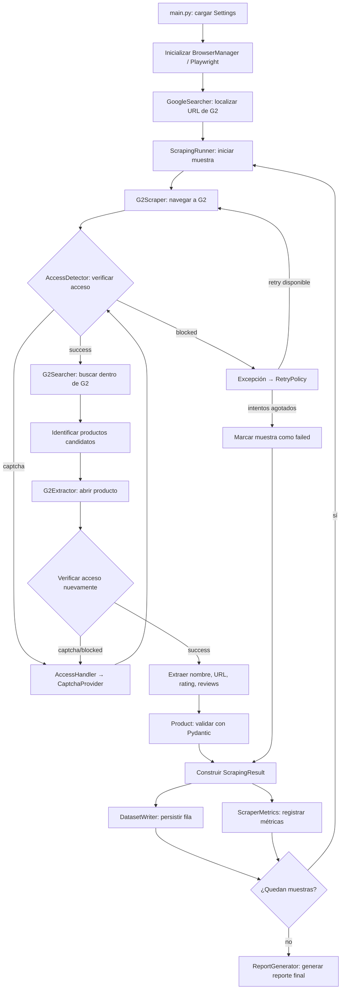

# Flujo de Scraping (G2)

Este documento describe el flujo de ejecución del sistema de scraping para G2: la secuencia de pasos que ocurre desde la inicialización hasta la persistencia de resultados, incluyendo los puntos de verificación de acceso y las decisiones que puede tomar el sistema en cada etapa.

Este documento complementa la [Arquitectura del Sistema](./arquitectura.md) y la [Estrategia de Resiliencia](./resiliencia.md): mientras esos documentos describen *componentes* y *manejo de errores*, este describe el *orden temporal* en que ocurren las cosas.

---

## 1. Visión General del Flujo

El flujo se ejecuta una vez por cada muestra (`sample_id`), y se repite hasta completar el total configurado (`SAMPLE_COUNT`). Una muestra fallida no detiene el proceso: `ScrapingRunner` continúa con la siguiente.

---

## 2. Etapas del Flujo

| # | Etapa | Componente responsable | Descripción |
|---|---|---|---|
| 1 | Configuración | `Settings` | Carga variables de entorno (`SAMPLE_COUNT`, `HEADLESS`, `MAX_PRODUCTS`, etc.). |
| 2 | Inicialización del navegador | `BrowserManager` | Levanta el contexto de Playwright, reutilizado entre muestras. |
| 3 | Localización de G2 | `GoogleSearcher` | Encuentra la URL de G2 a partir de una búsqueda en Google. |
| 4 | Inicio de muestra | `ScrapingRunner` | Asigna `sample_id`, arranca el cronómetro de `execution_time`. |
| 5 | Navegación | `G2Scraper` | Navega a la página objetivo dentro de G2. |
| 6 | Verificación de acceso | `AccessDetector` | Determina el estado: `success`, `captcha`, `blocked` o `unknown`. |
| 7 | Gestión de CAPTCHA | `AccessHandler` + `CaptchaProvider` | Si el estado es `captcha`, delega la resolución y vuelve a verificar. |
| 8 | Recuperación de bloqueo | `RetryPolicy` | Si el estado es `blocked`, aplica backoff exponencial y reintenta. |
| 9 | Búsqueda interna | `G2Searcher` | Busca el término dentro de G2 una vez hay acceso. |
| 10 | Identificación de candidatos | `G2Extractor` | Normaliza URLs relativas, elimina duplicados, limita a `MAX_PRODUCTS`. |
| 11 | Apertura de producto | `G2Extractor` + `G2UIHandler` | Abre una página nueva por producto dentro del mismo contexto; `G2UIHandler` gestiona elementos de UI que interfieren. |
| 12 | Re-verificación de acceso | `AccessDetector` | Se repite la verificación por cada producto abierto. |
| 13 | Extracción de datos | `G2Extractor` | Extrae `product_name`, `product_url`, `rating`, `reviews`. |
| 14 | Validación | `Product` (Pydantic) | Normaliza reviews (`'(7,964)'` → `7964`), convierte rating a `float`, valida `product_url` como `HttpUrl`. |
| 15 | Construcción del resultado | `ScrapingResult` | Agrupa productos, `access_status`, `attempts`, `failure_reason`. |
| 16 | Persistencia | `DatasetWriter` | Escribe una fila por producto en el dataset CSV. |
| 17 | Medición | `ScraperMetrics` | Acumula `success_rate`, `failure_rate`, `average_execution_time`, `average_attempts`. |
| 18 | Repetición | `ScrapingRunner` | Continúa con la siguiente muestra hasta agotar `SAMPLE_COUNT`. |
| 19 | Reporte final | `ReportGenerator` | Genera el reporte consolidado tras procesar todas las muestras. |

---

## 3. Puntos de Decisión Clave

- **¿El acceso fue exitoso?** → continúa el flujo normal (búsqueda/extracción).
- **¿Se detectó CAPTCHA?** → se delega a `CaptchaProvider`; tras la gestión, se vuelve a verificar el acceso antes de continuar.
- **¿Se detectó bloqueo (`blocked`)?** → se lanza una excepción (`AccessBlockedError`) y `RetryPolicy` decide si reintentar con backoff (`delay = base_delay * 2^attempt`) o marcar la muestra como `failed`.
- **¿Se agotaron los intentos?** → la muestra se registra como `failed` con su `failure_reason`, y `ScrapingRunner` continúa con la siguiente sin detener el proceso completo.

---

## 4. Salida del Flujo

Al finalizar las `SAMPLE_COUNT` muestras, el sistema produce tres artefactos:

1. **Dataset CSV** (`DatasetWriter`): una fila por producto, con columnas de negocio (`product_name`, `product_url`, `rating`, `reviews`) y columnas operacionales (`sample_id`, `access_status`, `attempts`, `execution_time`, `failure_reason`).
2. **Métricas** (`ScraperMetrics`): `total_requests`, `successful_requests`, `failed_requests`, `success_rate`, `failure_rate`, `average_execution_time`, `average_attempts`.
3. **Reporte final** (`ReportGenerator`): consolida las métricas anteriores en un formato legible para análisis.